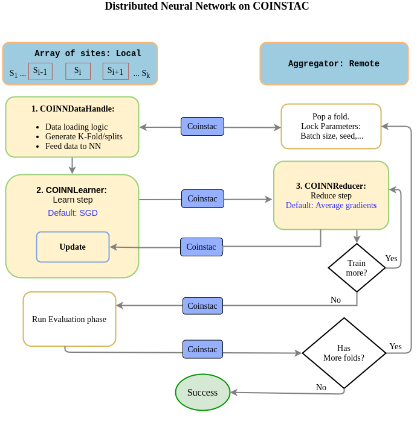

# coinstac-dinunet
Distributed Neural Network implementation  on COINSTAC.

```pip install coinstac-dinunet```

[](https://github.com/trendscenter/coinstac-dinunet/actions)


## Reducing gradients across sites.



### 1. Define Local Node
```python

```
### 2. Define Remote Node
```python

```
### 3. Define Trainer
```python

```

### 4. Define custom metrics
```python

```

